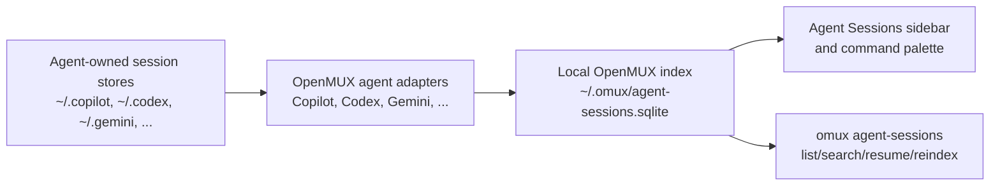
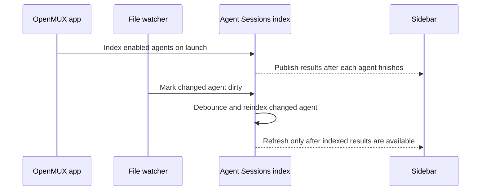
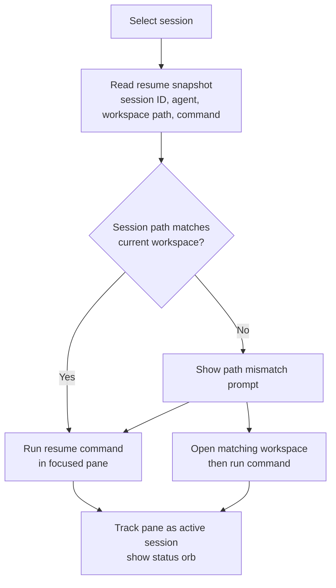

# Agent Sessions

Agent Sessions is OpenMUX's local view of work you have done with coding agents such as GitHub Copilot, Codex, and Gemini. It lets you search previous sessions, see which sessions are currently active in OpenMUX, resume a session in a terminal pane, and remove sessions from the local OpenMUX index.

Agent Sessions is local-first. OpenMUX reads session metadata from agent-owned files on your Mac and stores a searchable index under `~/.omux/`. It does not upload transcripts or agent data.

## What you can do

- Open the sidebar from **View -> Toggle Agent Sessions**, **Agents -> Show Agent Sessions**, or the command palette.
- Filter by workspace and agent.
- Search indexed session titles and transcript text.
- Resume a session in the focused terminal pane.
- See active sessions and their status orb when a resumed session is running in an OpenMUX pane.
- Delete a session from the row context menu.


## How sessions are loaded

OpenMUX keeps a local SQLite index at `~/.omux/agent-sessions.sqlite`.



OpenMUX uses one adapter per supported agent:

| Agent | Primary source | Notes |
| --- | --- | --- |
| Copilot | `~/.copilot/session-store.db` | Reads the `sessions` table directly (`id`, `cwd`, `summary`, `updated_at`). Recent `session-state` files are used only when the database is unavailable or empty, so normal startup does not block on scanning large session-state files. |
| Codex | `~/.codex` state databases and JSONL session files | Prefers the newest indexed record when both sources describe the same session. |
| Gemini | `~/.gemini/tmp/**/logs.json` | Groups log rows by session ID and uses message timestamps. |
| Claude, opencode, pi, rovodev | Known local homes and common JSONL/SQLite layouts | Support depends on the agent's local file format. |

You can override agent homes and included agents in `~/.omux/config.toml`; see [Configuration](./configuration.md#agent-sessions-settings).

## Indexing and refresh behavior

OpenMUX indexes sessions at startup when Agent Sessions is enabled and `index_on_launch` is true. It also watches known agent directories for changes and performs small background refreshes when files change.



The sidebar keeps existing rows visible while refreshes run. It updates the row list only when the indexed result set changes, so a refresh should not blank the pane or blink through an empty state. Sidebar pages fetch `sidebar_rows_per_agent` rows per enabled agent, defaulting to 10.

If new sessions do not appear immediately, use **Agents -> Reindex Agent Sessions** or the refresh button in the sidebar. The CLI equivalent is:

```bash
omux agent-sessions reindex
```

## Resume flow

Each indexed session can include a resume command. OpenMUX builds the command from the agent type and the session ID, for example:

```text
copilot --resume '<session-id>'
codex resume '<session-id>'
gemini --resume '<session-id>'
```

You can customize resume commands per agent in config.



When a resumed session runs in an OpenMUX pane, the Agent Sessions sidebar marks the row as **ACTIVE**. The status orb uses the same states as pane tabs:

| Orb state | Meaning |
| --- | --- |
| Pulsing accent | The agent is working. |
| Yellow | The agent needs input. |
| Blue | The agent is idle. |
| Red | The agent reported an error. |

Status comes from the same pane status pipeline used by workspace pane tabs, including the bundled AI Status plugin when enabled.

Active sessions are pinned to the top of the list and shown with the status orb on the date row. Use the open/focus icon on a row to resume it or jump to the existing tab/pane where that session is running.

## Searching and filtering

The sidebar filters on:

- workspace scope: current workspace, all workspaces, or a specific workspace
- agent: all agents or one agent
- search text: session title, agent name, path, ID, and indexed transcript text

The CLI uses the same index:

```bash
omux agent-sessions list
omux agent-sessions search "release notes"
omux agent-sessions resume copilot:<session-id> --workspace
```

The legacy `omux vault ...` command names still work as compatibility aliases, but `omux agent-sessions ...` is the preferred public command.

## Deleting sessions

Use **Delete Session...** from a row's context menu to delete the session from the agent's local session store when OpenMUX knows how to do that safely. OpenMUX also removes its indexed copy and records a local tombstone so unsupported or partially deleted sessions are not immediately re-added by the next background reindex.

Deletion affects local files/databases on your Mac. It does not delete any cloud/provider history the agent may keep outside the local session store. If you later import the session explicitly, OpenMUX clears the tombstone and indexes it again.

## Configuration

Agent Sessions is enabled by default. A minimal config looks like:

```toml
[agent-sessions]
enabled = true
preview = true
index_on_launch = true
included_agents = ["copilot", "codex", "gemini"]

[agent-sessions.agents.copilot]
home = "~/.copilot"
resume_command = "copilot --resume {session_id}"
```

The older `[vault]` and `[vault.agents.*]` names are still accepted for compatibility. When both old and new keys exist, `[agent-sessions]` wins.

See [Configuration](./configuration.md#agent-sessions-settings) for the full key list.
